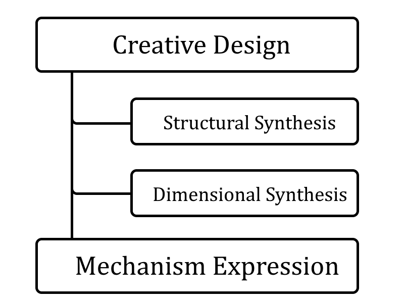

# Introduction

According to the overview of computer-based design synthesis researches, the synthesis design flow is divided into the following categories: Function-based, Grammar-based and Analogy-based.

Function-based synthesis is to redesign the decomposed partial solutions due to the functionality of product. Grammar-based synthesis is a type of conceptual design by using generative grammars. Analogy-based synthesis design is drawing inspiration from the previous design knowledge.

The major concept of recreating an existing mechanism is to synthesize the mechanism through the Creative Design Flow of Mechanism. A mechanism has two properties according to its functional appearance, which are the structure and dimension, where the structure is related to the adjacency between the joints and links, and the dimension means the distance and orientation of the joints in space. The design flow, including structural synthesis and dimensional synthesis is also related to the Graph Theory and kinematics simulation.

# Related Works

Planar linkage mechanisms have a very wide range of applications, such as windshield wipers, pure gear system, cushion mechanism, etc. Some of the spatial linkage mechanism is composed of planar components, for example, a parallel manipulator can be composed by multiple four bar linkage components. All those designs of applications need to organize the manufacture of the products then verify their comprehensiveness, and that is indispensable with the assistance of computer.

Furthermore, the design process of planar linkage mechanisms can be categorized as the "Creative Design", "Dimensional Synthesis" and "Mechanism Expression" respectively.

{#fig:major-composition-extended width=45%}

In the composition of this research, the proposed graph expression is our design grammar; the "Mechanism Expression" is the result grammar of "Structural Synthesis" and the "Dimensional Synthesis" is under the scope of Creative Design.

With the Metaheuristic Random Algorithms, Numerical Methods or Enumeration Algorithms, the design problems can be solved by various convergence strategies under realistic constraints. In this case, Python programming language is a tool for high-speed abstract logic development, cross platform environment and concise expression, will be used for the implementation of these concepts.

# Mechanism Synthesis

In this research, the design methods of structural synthesis, dimensional synthesis, and kinematic simulation for planar multi-link mechanism were investigated and implemented as an open-source software package named Pyslvs. The core program architecture uses the improved Planar Mechanism Kinematic Simulator (PMKS) as the data representation for design results, which can simultaneously express the topological structure and dimensional relationship. Therefore, Pyslvs can import and export the evaluated mechanism expression systematically.

{#fig:design-flow-extended}

For the structural synthesis part, the Edge Set of the graph was enumerated to construct the atlas of generalized chain. While in the dimensional synthesis process, one of three evolutionary computation methods can be applied to optimize the requested path generation. As for kinematic simulation of the mechanism is based on two different open source geometric constraint solver libraries, Solvespace and Sketch Solve, which the Newton-Raphson method and BFGS algorithm were used accordingly.

# Summary

To the end of this thesis, the configuration of the position analysis module is performed by stack representation to generate a verification model for the associated planar linkage mechanism, and multiple examples are used to demonstrate the relevant functionality of the accomplished software package.
